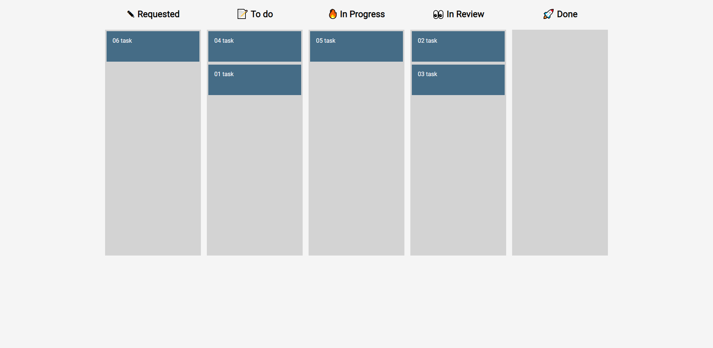

# Kanban Board
        
## 🌟[Description](#table-of-contents)
A Kanban-Board app for keeping track of things that need to get done.

The Kanban-Board app provides a simple and clean interface for a functional and minimal task management application. 


<p>
    
    
    
    
    
</p>

## Table-of-Contents
* [Description](#description)
* [Submission](#User-Stor)
* [Mock-Up](#Mock-Up)
* [Installation](#installation)
* [License](#License)
* [Contributing](#contributing)
* [FAQs](#faqs)
  
## 🚀 [Submission](#table-of-contents)

Deployed app : https://vimukthigunasekara.github.io/kanban-board/
</br>
Github Page : https://github.com/VimukthiGunasekara/kanban-board


## 📺 [Mock-Up](#table-of-contents)


      
## ⚙️ [Installation](#table-of-contents)
Use your terminal to clone or download or copy the zip file to a directory of your choice. Then open the file in VS Code or whatever editor you use. In VS Code, open the terminal and navigate to Kanban Board in the root directory. 
``` 
npm i
npm i react-beautiful-dnd
npm i uuid
npm start
```   

## 📑 [License](#table-of-contents)


Your repository is licensed under an mit open source license, so other people can contribute more easily.More information can be found by clicking this [link.](https://choosealicense.com/licenses/mit)

## 🤝 [Contributing](#table-of-contents)
We are open to all kinds of contributions. If you want to:
* 🤔 Suggest a feature
* 🐛 Report an issue
* 📖 Improve documentation
* 👨‍💻 Contribute to the code

We are excited that you are reading this and are willing to contribute. No need to think big. Even a typo fix might save our day and make you a hero. Every contribution counts!
     
Feel free to check [issues page](https://github.com/VimukthiGunasekara/kanban-board/issues) 
     
## 🤔 [FAQs](#table-of-contents)
Please contact me using the following links :
[Vimukthi Gunasekara](https://github.com/VimukthiGunasekara)


